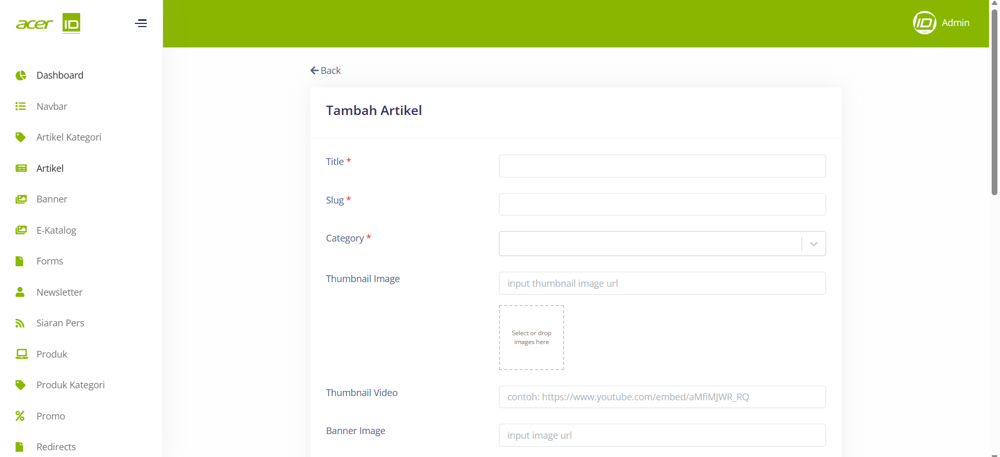

# Create New Artikel 

>Pada menu artikel, pengguna akan menemukan berbagai field yang perlu diisi seperti Title untuk judul artikel, Slug untuk URL yang terkait dengan artikel tersebut, Category untuk kategori artikel, Thumbnail Image untuk gambar kecil yang akan mewakili artikel, Thumbnail Video untuk video kecil sebagai pengganti gambar jika ada, Banner Image untuk gambar utama yang memenuhi latar belakang halaman, dan Content untuk isi artikel yang akan ditampilkan kepada pembaca. Semua field ini berperan penting dalam menyusun dan mempresentasikan artikel dengan baik agar dapat memberikan pengalaman membaca yang optimal bagi pengunjung.

## Settings
>Pada bagian Settings juga terdapat pengaturan untuk tampilan yang akan muncul pada storefront seperti "Dark Mode" dan juga beberapa pengaturan yang dapat mempengaruhi SEO pada artikel tersebut.