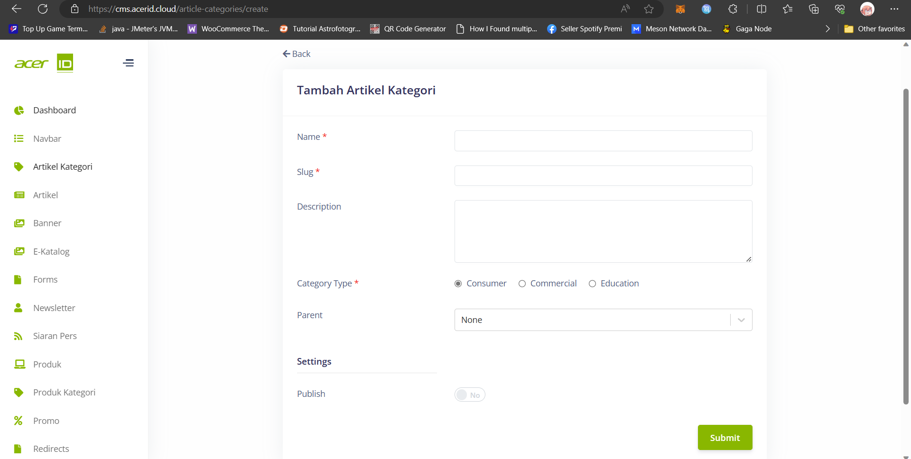

# Create New Artikel Kategori 

> Dalam button Create New yang berada di Artikel Kategori, ini digunakan untuk menambahkan kategori baru yang bisa digunakan untuk meng-kategorikan beberapa artikel kedalam kategori ini.

## Title
>Title adalah judul / nama kategori yang akan diisi.
## Slug
>Slug adalah URL yang akan diisi untuk navigasi kedalam kategori ini.
## Description
>Description adalah deskripsi yang menjelaskan kategori ini tentang apa.
## Category Type
>Category Type adalah pilihan kategori yang berbentuk radio button yang bisa dipilih untuk filter kategori tersebut masuk kedalam tipe kategori apa.
## Parent
>Parent adalah pilihan apakah kategori baru ini termasuk sub-kategori dari kategori yang telah ada.
## Publish
>Publish adalah untuk mengaktifkan kategori tersebut.