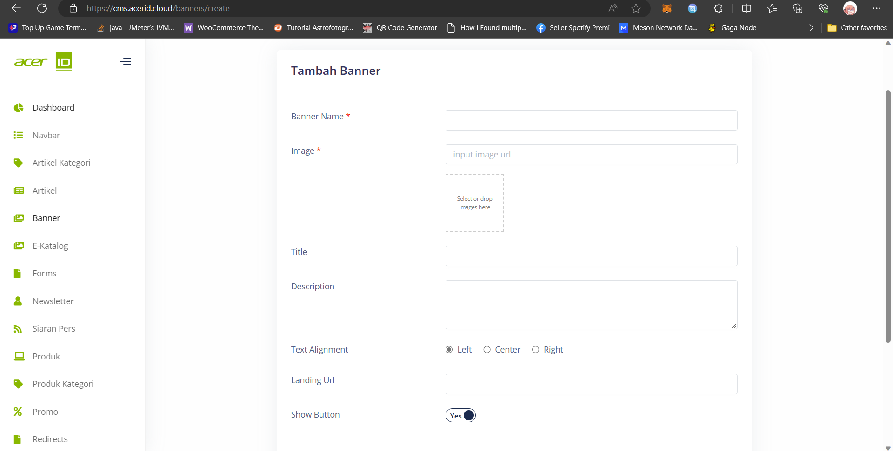

# Create New Banner 

>Pada menu banner, tersedia field-field yang perlu diisi seperti Banner Name untuk memberi nama pada banner, Image untuk memasukkan gambar yang akan ditampilkan dalam banner, Title untuk judul yang akan ditampilkan di atas gambar, Description untuk deskripsi yang akan ditampilkan di bawah judul, Text Alignment untuk mengatur posisi teks dalam banner, Landing URL untuk menentukan URL tujuan saat pengguna mengklik banner, dan Show Button untuk menampilkan atau menyembunyikan tombol di banner. Semua field ini memungkinkan pengguna untuk dengan mudah mengatur dan menyesuaikan tampilan dan konten banner agar dapat menarik perhatian pengunjung dan mencapai tujuan pemasaran yang diinginkan.

## Settings
>Pada bagian Settings juga terdapat pengaturan untuk mengatur apakah banner tersebut akan di publish atau tidak.