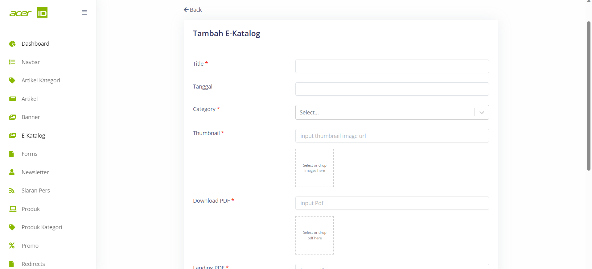

# Create New E-Katalog 

>Dalam menu E-Katalog, terdapat beberapa field yang harus diisi, seperti Title untuk memberi judul pada katalog, Tanggal untuk menandai tanggal rilis katalog tersebut, Category untuk menentukan kategori katalog yang sesuai, Thumbnail untuk menampilkan gambar kecil yang mewakili katalog, Download PDF untuk menyediakan tautan pengunduhan file PDF katalog, dan Landing PDF untuk menentukan URL tujuan saat pengguna mengklik katalog. Dengan menggunakan field-field ini, pengguna dapat dengan mudah mengatur dan mengelola E-Katalog mereka, sehingga memudahkan pengunjung untuk menjelajahi dan mengunduh katalog dalam format PDF yang relevan.

## Settings
>Pada bagian Settings juga terdapat pengaturan untuk mengatur apakah E-Katalog tersebut akan di publish atau tidak.