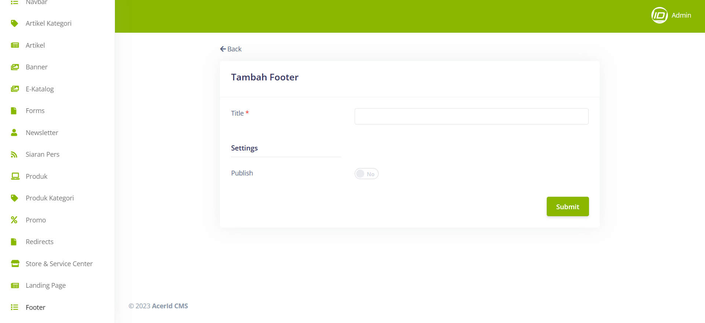

# Create New Footer 

>Pada menu Footer, terdapat beberapa field penting yang harus diisi, seperti Title untuk memberikan judul pada bagian footer, Footer untuk mengatur konten utama pada footer, Sub Footer untuk menambahkan konten tambahan atau informasi pendukung di bawah footer utama, Landing URL untuk menentukan URL tujuan saat pengguna mengklik bagian footer, dan Publish untuk mempublikasikan perubahan yang telah dilakukan.