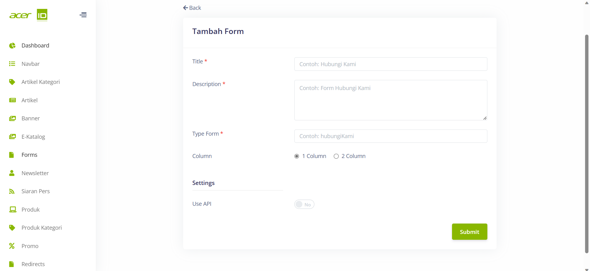

# Create New Forms 

>Pada menu Forms, pengguna akan menemukan beberapa field yang penting untuk diisi, termasuk Title untuk memberikan judul pada formulir, Description untuk memberikan deskripsi atau penjelasan tentang formulir tersebut, TypeForm untuk menentukan jenis formulir yang akan digunakan, Column untuk mengatur tata letak kolom dalam formulir.

## Settings
>Pada bagian Settings juga terdapat pengaturan Use API untuk mengizinkan penggunaan API terkait dengan formulir tersebut. Melalui pengaturan yang tepat pada field-field ini, pengguna dapat dengan mudah membuat formulir sesuai dengan kebutuhan mereka, memberikan informasi yang jelas kepada pengisi formulir, menentukan jenis formulir yang sesuai, mengatur tata letak yang optimal, dan mengintegrasikan formulir dengan API untuk memperluas fungsionalitasnya..