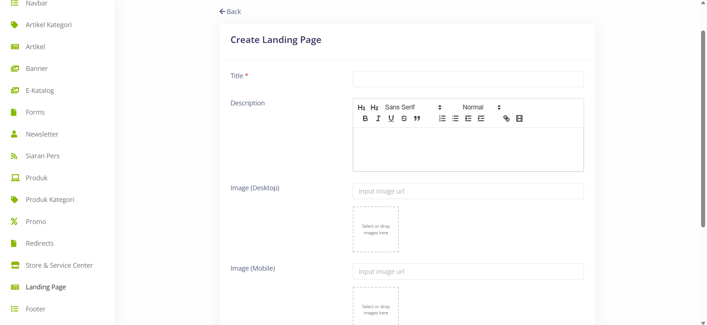

# Create New Landing Page 

>Pada menu Landing Page, terdapat beberapa field penting yang perlu diisi, seperti Title untuk memberikan judul pada halaman utama, Description untuk memberikan deskripsi atau penjelasan tentang halaman tersebut, Image (Desktop) untuk memasukkan gambar yang akan ditampilkan pada tampilan desktop, Image (Mobile) untuk gambar yang ditampilkan pada tampilan mobile, Slug untuk menentukan URL yang terkait dengan halaman tersebut, dan Publish untuk mempublikasikan halaman landing tersebut.