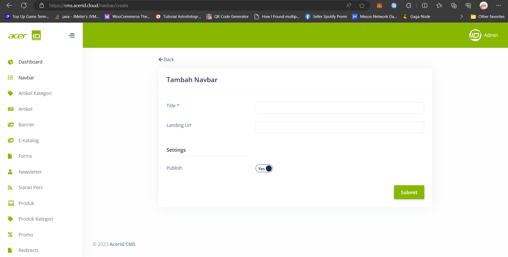

# Create New Navbar 

>Dalam Page Create New yang terdapat pada Menu Page Navbar, disini adalah page untuk menambahkan navbar baru/menu header baru untuk ditampilkan di store front.

## Title
>Kolom Title diisi dengan text menu yang akan tampil pada storefront.

## Landing URL
>Kolom Landing URL diisi dengan URL yang akan dituju pada saat di klik di dalam storefront.

## Publish
>Pada Publish hanya terdapat pilihan Yes/No yang berfungsi untuk menampilkan atau menonaktifkan navbar/menu tersebut.