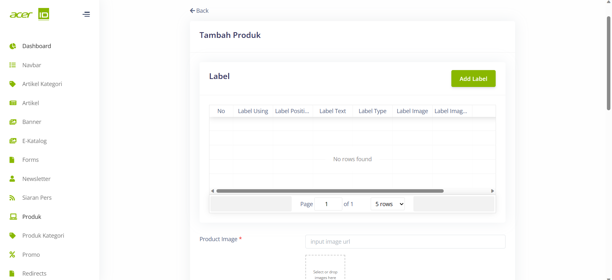

# Create New Produk 

>Pada menu Produk, terdapat berbagai field yang perlu diisi, seperti Label untuk memberi label atau tanda khusus pada produk, Product Image untuk memasukkan gambar produk yang akan ditampilkan, Name untuk memberi nama pada produk, Description untuk memberikan deskripsi yang menjelaskan produk dengan detail, Highlight untuk menyoroti fitur utama atau keunggulan produk, Is Highlight untuk menandai apakah produk tersebut merupakan highlight atau tidak, Price untuk menentukan harga produk, Discount Type untuk menentukan jenis diskon yang berlaku, Final Price untuk menampilkan harga akhir setelah diskon, Category untuk menentukan kategori produk, Sub Category untuk menentukan sub-kategori yang lebih spesifik, Kode Produk untuk memberikan kode unik pada produk, Detail URL untuk menentukan URL yang mengarah ke halaman detail produk, dan Store URL untuk menautkan produk dengan URL toko yang relevan.

## Settings
>Pada bagian Settings terdapat pengaturan untuk mengatur apakah Produk tersebut akan di publish atau tidak. Dan juga ada pengaturan untuk mengatur produk tersebut Coming Soon atau tidak.