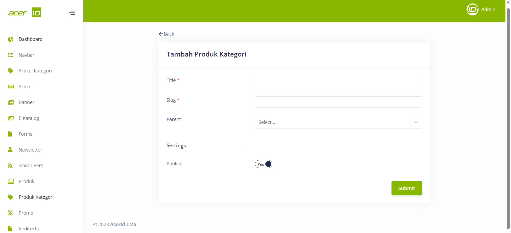

# Create New Produk Kategori 

>Pada menu Produk Kategori, terdapat field-field penting yang perlu diisi, seperti Title untuk memberikan judul pada kategori produk, Slug untuk menentukan URL yang terkait dengan kategori tersebut, dan Parent untuk menunjukkan hubungan dengan kategori induk atau kategori yang lebih tinggi dalam hierarki kategori produk.

## Settings
>Pada bagian Settings juga terdapat pengaturan untuk mengatur apakah Produk Kategori tersebut akan di publish atau tidak.