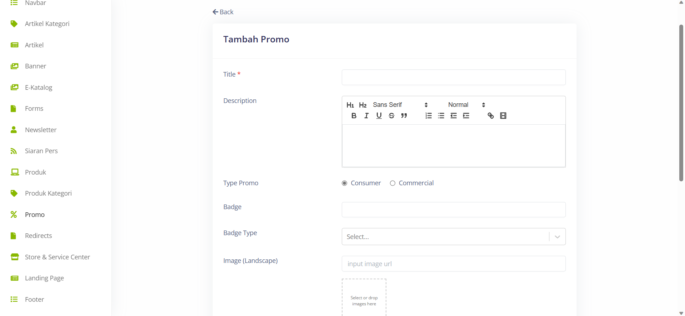

# Create New Promo 

>Dalam menu Promo, terdapat beberapa field penting yang harus diisi, seperti Title untuk memberikan judul pada promo, Description untuk memberikan deskripsi atau penjelasan singkat tentang promo tersebut, Type Promo untuk menentukan jenis promo yang sedang berlangsung, Badge untuk menampilkan tanda pengenal atau label khusus pada promo, Badge Type untuk menentukan jenis tanda pengenal atau label yang digunakan, Image untuk memasukkan gambar terkait dengan promo, dan Landing Page untuk menentukan halaman tujuan ketika pengguna mengklik promo tersebut.

## Settings
>Pada bagian Settings juga terdapat pengaturan untuk mengatur apakah Promo tersebut akan di publish atau tidak.