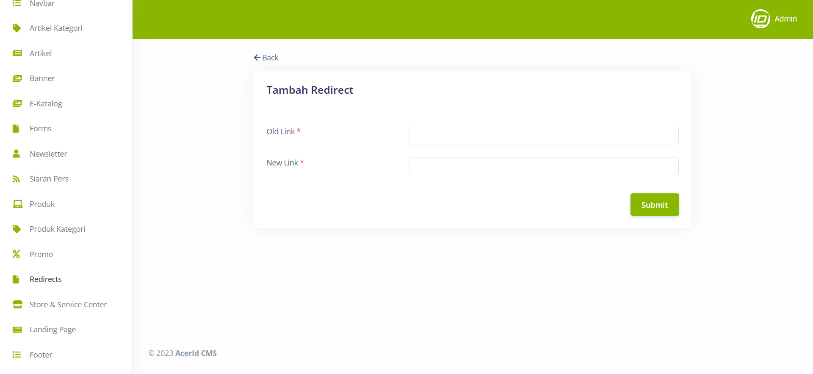

# Create New Redirects 

>Pada menu Redirects, terdapat field-field penting yang harus diisi, seperti Old Link untuk memasukkan URL lama yang ingin diarahkan ulang, dan New Link untuk menentukan URL baru tempat pengunjung akan dialihkan. Dengan menggunakan field-field ini, pengguna dapat dengan mudah mengatur pengalihan URL untuk mengarahkan pengunjung dari URL lama ke URL baru yang relevan.