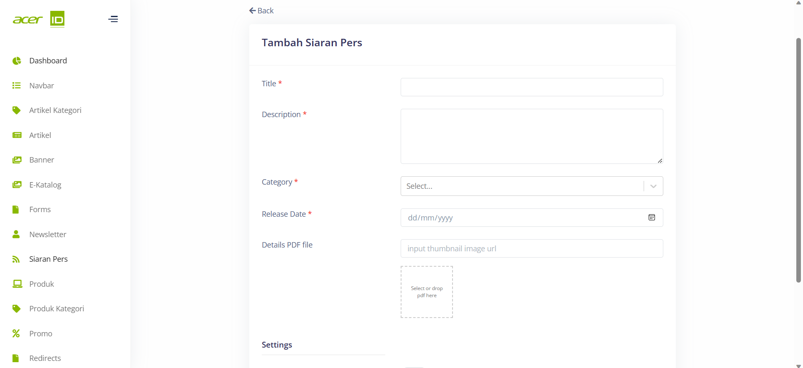

# Create New Siaran Pers 

>Pada menu Siaran Pers, terdapat beberapa field yang penting untuk diisi, seperti Title untuk memberikan judul pada siaran pers, Description untuk memberikan deskripsi atau ringkasan tentang siaran pers tersebut, Category untuk menentukan kategori yang sesuai untuk siaran pers tersebut, Release Date untuk menandai tanggal rilis siaran pers, Details PDF File untuk menyediakan file PDF yang berisi informasi rinci mengenai siaran pers.

## Settings
>Pada bagian Settings juga terdapat pengaturan Publish untuk mempublikasikan siaran pers tersebut untuk mengatur apakah Siaran Pers tersebut akan di publish atau tidak.