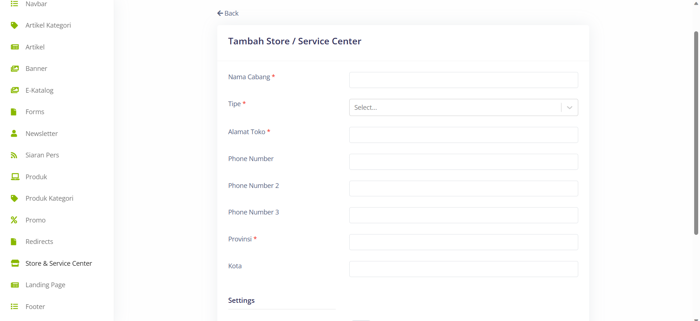

# Create New Store & Service Center 

>Pada menu Store & Service Center, terdapat field-field penting yang harus diisi, seperti Nama Cabang untuk memberikan nama pada cabang atau toko, Tipe untuk menentukan jenis atau kategori cabang tersebut, Alamat Toko untuk memasukkan alamat lengkap dari toko atau pusat layanan, Phone Number untuk memberikan nomor telepon yang dapat dihubungi, Provinsi dan Kota untuk menentukan lokasi cabang secara geografis.

## Settings
>Pada bagian Settings terdapat Use Link Whatsapp untuk mengaktifkan penggunaan tautan Whatsapp, dan Link Whatsapp untuk menyediakan tautan Whatsapp yang terhubung dengan cabang atau toko tersebut.